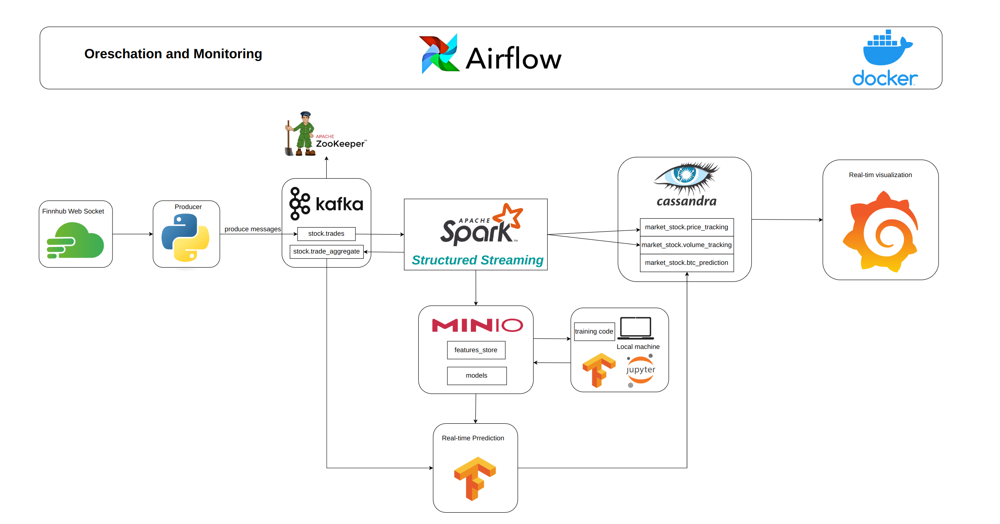

### Project Overview

### Project DescriptionD

Developed a comprehensive real-time data pipeline for stock market tracking and prediction. The system ingests trade data from the Finnhub WebSocket and produces messages to a Kafka cluster. Leveraged Spark Structured Streaming to process real-time data, which is then ingested into Cassandra, Kafka topics, and MinIO.

The processed data stored in Cassandra is visualized in real-time using Grafana, while data stored in MinIO is utilized to train an LSTM model using TensorFlow for BTC price prediction. After training, the model is stored in MinIO and deployed to serve real-time predictions using data from Kafka topics. The entire pipeline is orchestrated and monitored with Apache Airflow, ensuring smooth operation and scalability.

### Technologies Used:
- Python
- Spark
- Kafka
- MinIO
- Docker
- Cassandra
- TensorFlow
- Grafana

### Demo